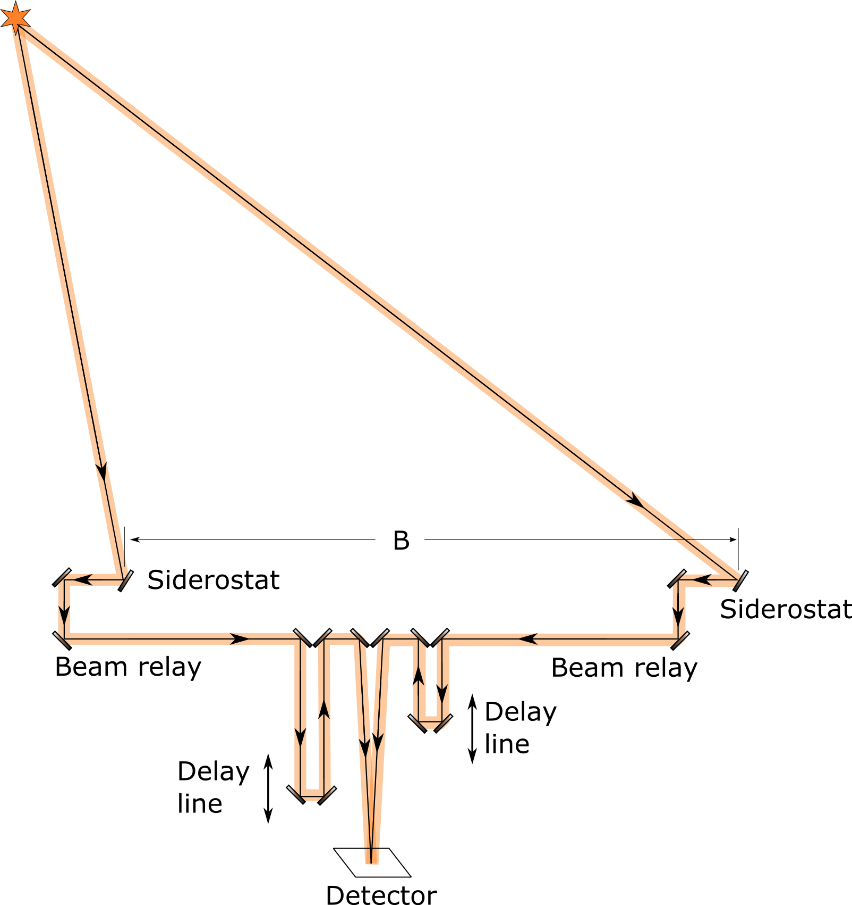

This website provides supplementary material for the book ["Practical Optical Interferometry: Imaging at visible and infrared wavelengths"](http://www.cambridge.org/us/academic/subjects/astronomy/observational-astronomy-techniques-and-instrumentation/practical-optical-interferometry-imaging-visible-and-infrared-wavelengths), published by Cambridge University Press. A preview of the book is available on [Google Books](https://books.google.co.uk/books?id=3XgZCgAAQBAJ&lpg=PR8&ots=99oJnFmTh3&lr=lang_en&pg=PP1#v=onepage&q&f=false).

The supplementary material consists of

 * [Source material for the figures](figures): Python code for the plots in the book and editable versions of the diagrams.
 * An [interferometry simulation framework](https://github.com/dbuscher/pois): a basic Python framework for simulating the data from a ground-based optical interferometer
* [Links to other online material](online): websites with further information about interferometry, data reduction and image reconstruction software etc.
 * Errata

